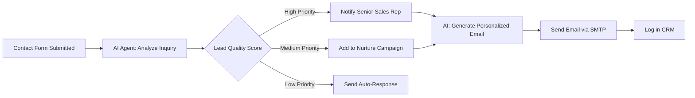
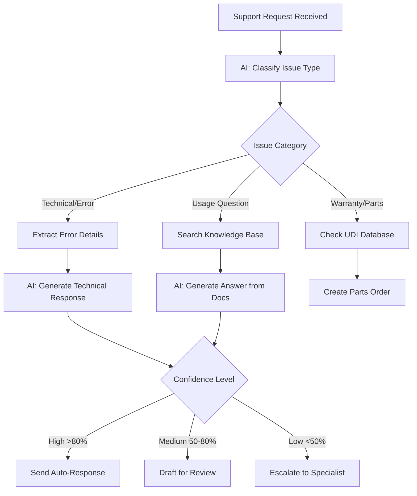
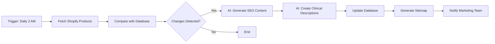
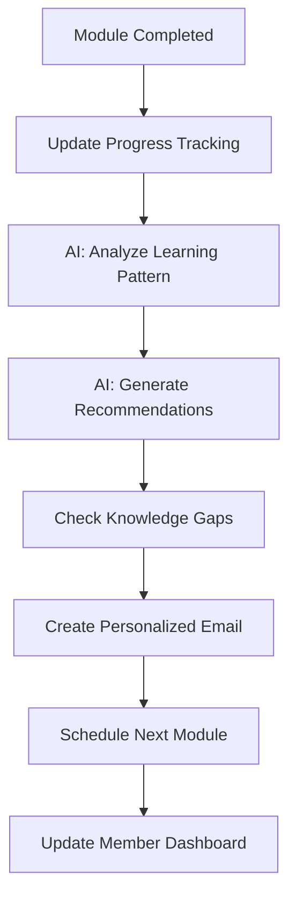
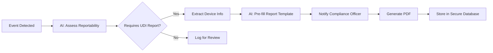
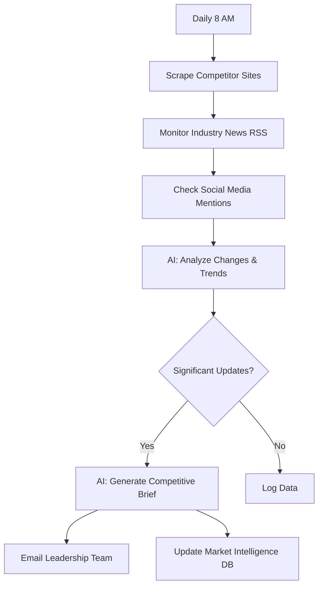
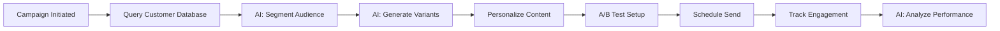

# n8n AI Workflow Documentation for Aesthetic ProTools

## Overview
This document outlines AI-powered workflow automations using n8n to streamline business processes for Aesthetic ProTools, a laser equipment manufacturer and distributor.

---

## Workflow 1: Intelligent Lead Qualification & Follow-Up

### Purpose
Automatically qualify incoming demo requests and contact form submissions, then route to appropriate sales representatives with AI-generated personalized follow-up emails.

### Trigger
- Webhook from Contact Form submission
- New entry in "contacts" database table

### Workflow Steps



### AI Agent Configuration

**Model**: `openai/gpt-5-mini` (cost-effective for classification)

**System Prompt**:
```
You are a lead qualification specialist for Aesthetic ProTools, a medical laser equipment company.

Analyze the contact form submission and provide:
1. Lead Quality Score (1-10)
2. Primary Interest Area (Sales, Support, Training, Partnership)
3. Urgency Level (Low, Medium, High)
4. Recommended Next Action
5. Key talking points for sales follow-up

Consider factors:
- Practice size/type mentioned
- Specific product interest
- Timeline indicators
- Budget signals
- Current equipment ownership
```

**Input Variables**:
- `name`: Contact name
- `email`: Contact email
- `phone`: Phone number
- `message`: Inquiry message
- `interest`: Selected interest area

**Output**: Structured JSON with qualification data

---

## Workflow 2: Customer Support Ticket Triage & Response

### Purpose
Automatically categorize support tickets, generate initial responses, and escalate complex technical issues to appropriate specialists.

### Trigger
- New message in Support Portal
- Email to support@aestheticprotools.com

### Workflow Steps



### AI Agent Configuration

**Model**: `google/gemini-2.5-flash` (balanced multimodal for attachments)

**System Prompt**:
```
You are a technical support specialist for Aesthetic ProTools laser equipment, specifically the VADER Laser system.

Equipment Details:
- VADER Laser: Multi-wavelength aesthetic laser (755nm, 808nm, 1064nm)
- Common treatments: Hair removal, skin rejuvenation, vascular lesions
- Key features: Contact cooling, adjustable spot sizes, multi-pulse modes

Your role:
1. Classify support tickets into: Technical Error, Usage Question, Maintenance, Parts/Warranty, Training
2. For technical issues: Extract error codes, symptoms, and operating conditions
3. Generate clear, step-by-step troubleshooting guidance
4. Include safety reminders when relevant
5. Recommend escalation for hardware failures or urgent safety concerns

Always maintain a professional, empathetic tone and prioritize patient safety.
```

**Knowledge Base Context**: Include training video transcripts, user manual excerpts, and FAQ database

---

## Workflow 3: Shopify Product Sync with AI Content Enhancement

### Purpose
Sync products from Shopify, then use AI to generate SEO-optimized descriptions, meta tags, and clinical usage guidelines.

### Trigger
- Scheduled daily at 2 AM
- Manual trigger from Admin Portal

### Workflow Steps



### AI Agent Configuration

**Model**: `openai/gpt-5` (superior for creative content)

**System Prompt**:
```
You are a medical aesthetics copywriter and SEO specialist for Aesthetic ProTools.

For each product, generate:

1. SEO Meta Title (50-60 characters)
   - Include primary keyword
   - Brand name at end
   - Format: "Product Name - Key Benefit | Aesthetic ProTools"

2. Meta Description (140-160 characters)
   - Include target keyword naturally
   - Highlight unique selling proposition
   - Include call-to-action

3. Product Description (200-300 words)
   - Professional yet accessible tone
   - Highlight clinical applications
   - Include wavelength specifications
   - Mention FDA clearance/certifications
   - Safety and efficacy data
   - Semantic HTML structure with H2/H3 headings

4. Clinical Usage Summary
   - Treatment indications
   - Recommended settings
   - Expected results timeline
   - Contraindications

Use medical terminology appropriately while remaining accessible to aesthetic practitioners.
```

**Input Variables**:
- Product title, price, features from Shopify
- Existing product specifications

**Output**: Enriched product content ready for database insertion

---

## Workflow 4: Training Content Personalization

### Purpose
Analyze member progress in Technical Training Library and generate personalized learning paths with AI-curated recommendations.

### Trigger
- Member completes a video module
- Weekly progress report generation

### Workflow Steps



### AI Agent Configuration

**Model**: `google/gemini-2.5-flash-lite` (fast for simple recommendations)

**System Prompt**:
```
You are an educational advisor for medical laser equipment training.

Available Modules:
1. VADER Laser Quickstart
2. Advanced Clinical Settings
3. Troubleshooting & UDI Reporting
4. Safety Protocols & Compliance
5. Patient Consultation Best Practices
6. Multi-Wavelength Treatment Planning
7. Maintenance & Calibration
8. Business & Marketing for Aesthetic Practices

Based on member progress data, recommend:
1. Next logical module (with reasoning)
2. Prerequisite review if knowledge gaps detected
3. Advanced modules for high performers
4. Practical exercises or case studies
5. Estimated time to competency

Tone: Encouraging, professional, focused on clinical excellence.
```

---

## Workflow 5: UDI Reporting Automation

### Purpose
Monitor equipment usage, detect reportable events, and automatically generate pre-filled UDI reports for FDA compliance.

### Trigger
- Equipment error log entry
- Adverse event flag in system
- Monthly compliance report

### Workflow Steps



### AI Agent Configuration

**Model**: `openai/gpt-5-mini` (structured output for compliance)

**System Prompt**:
```
You are a medical device regulatory compliance specialist.

Evaluate equipment events for FDA UDI reporting requirements under 21 CFR Part 803.

Reportable events include:
- Device malfunction that could cause/contribute to death or serious injury
- Serious injury attributed to device
- Device malfunction requiring remedial action

For reportable events, extract and structure:
1. Device Identification (UDI, model, serial number)
2. Event Date/Time
3. Event Description
4. Patient Impact Assessment
5. Manufacturer Actions Taken
6. Root Cause Analysis (if available)

Output Format: FDA Form 3500A compatible JSON structure

Be conservative - recommend reporting when uncertain.
```

---

## Workflow 6: Competitive Intelligence Monitoring

### Purpose
Monitor competitor websites, industry news, and social media for new product launches, pricing changes, and market trends.

### Trigger
- Scheduled: Daily at 8 AM
- Manual trigger for ad-hoc research

### Workflow Steps



### AI Agent Configuration

**Model**: `google/gemini-2.5-pro` (best for complex analysis)

**System Prompt**:
```
You are a competitive intelligence analyst for the medical aesthetics laser equipment market.

Competitors to monitor:
- Candela Corporation
- Cynosure (Hologic)
- Cutera
- Lumenis
- Syneron Candela

Analyze:
1. New product announcements
2. Pricing/promotion changes
3. Technology innovations
4. Clinical study publications
5. Market expansion activities
6. Customer sentiment shifts

Generate executive brief including:
- Summary of key developments
- Strategic implications for Aesthetic ProTools
- Recommended responses or actions
- Opportunities for differentiation

Tone: Analytical, objective, strategic
```

---

## Workflow 7: Email Marketing Personalization

### Purpose
Segment customer database and generate personalized email campaigns based on practice type, equipment ownership, and engagement history.

### Trigger
- New marketing campaign created
- Customer milestone (purchase anniversary, training completion)

### Workflow Steps



### AI Agent Configuration

**Model**: `openai/gpt-5` (creative writing excellence)

**System Prompt**:
```
You are an email marketing specialist for B2B medical equipment sales.

Audience Segments:
1. Prospective Buyers (never purchased)
2. Recent Purchasers (0-6 months)
3. Established Customers (6+ months)
4. High-Value Practices (multiple units)
5. Training Members
6. Lapsed Customers (no activity 12+ months)

For each segment, customize:
- Subject line (personalized, curiosity-driven)
- Opening hook (relevant to their journey stage)
- Value proposition (aligned with their needs)
- Social proof/testimonials (from similar practices)
- Call-to-action (appropriate next step)

Email best practices:
- Mobile-optimized formatting
- Single primary CTA
- Professional but conversational tone
- Include unsubscribe option
- Maximum 300 words body copy

Generate 3 subject line variants for A/B testing.
```

---

## Implementation Guide

### Prerequisites
- n8n instance (self-hosted or cloud)
- Lovable AI Gateway API key
- Supabase database access credentials
- Shopify API credentials (for product sync)
- Email SMTP configuration

### Setup Steps

1. **Install n8n**
   ```bash
   npx n8n
   ```

2. **Configure Credentials**
   - Add Lovable AI Gateway API key in n8n credentials
   - Configure Supabase connection (Project URL + Anon Key)
   - Add Shopify API credentials
   - Set up email SMTP

3. **Import Workflow Templates**
   - Each workflow above can be created as separate n8n workflows
   - Use HTTP Request nodes for AI Gateway calls
   - Use Supabase nodes for database operations

4. **AI Gateway Integration**

   Example HTTP Request node configuration for AI calls:
   ```json
   {
     "method": "POST",
     "url": "https://ai.gateway.lovable.dev/v1/chat/completions",
     "authentication": "predefinedCredentialType",
     "headers": {
       "Content-Type": "application/json"
     },
     "body": {
       "model": "openai/gpt-5-mini",
       "messages": [
         {
           "role": "system",
           "content": "{{$node['Set_System_Prompt'].json['prompt']}}"
         },
         {
           "role": "user",
           "content": "{{$node['Format_Input'].json['user_message']}}"
         }
       ],
       "temperature": 0.7,
       "max_tokens": 1000
     }
   }
   ```

5. **Testing & Validation**
   - Test each workflow with sample data
   - Validate AI response quality
   - Set up error handling and retry logic
   - Configure monitoring/alerting

### Best Practices

1. **Model Selection**
   - Use `gpt-5-mini` or `gemini-2.5-flash-lite` for simple classification/routing
   - Use `gpt-5` or `gemini-2.5-pro` for complex reasoning and content generation
   - Use `gemini-2.5-flash` for multimodal tasks (images + text)

2. **Prompt Engineering**
   - Provide specific context about Aesthetic ProTools products
   - Include examples of desired outputs
   - Set clear constraints (word count, format, tone)
   - Iterate based on real-world results

3. **Error Handling**
   - Implement fallback responses for AI failures
   - Set up human-in-the-loop for low-confidence decisions
   - Log all AI interactions for quality monitoring

4. **Data Privacy**
   - Never send PHI (Protected Health Information) to AI models
   - Anonymize customer data when possible
   - Implement data retention policies

5. **Cost Optimization**
   - Cache frequently used AI responses
   - Use streaming for real-time interactions
   - Batch process non-urgent requests
   - Monitor token usage and set budgets

---

## ROI Metrics

### Expected Outcomes

| Workflow | Time Saved | Quality Improvement | Cost Reduction |
|----------|------------|---------------------|----------------|
| Lead Qualification | 15 min/lead | +35% conversion | -$2K/month sales ops |
| Support Triage | 20 min/ticket | +45% CSAT | -$5K/month support costs |
| Product Content | 2 hrs/product | +60% SEO traffic | -$3K/month copywriting |
| Training Personalization | 30 min/member | +50% completion rate | +$8K/month retention |
| UDI Reporting | 45 min/report | 100% compliance | -$10K legal risk |
| Competitive Intel | 4 hrs/week | Better positioning | +$15K/month strategic value |
| Email Personalization | 3 hrs/campaign | +25% open rate | +$20K/month revenue |

**Total Estimated Annual Value**: $250K+ in time savings and revenue impact

---

## Maintenance & Monitoring

### Weekly Tasks
- Review AI response quality scores
- Check workflow execution logs
- Update prompts based on feedback

### Monthly Tasks
- Analyze ROI metrics
- Optimize model selection
- Update knowledge base content
- Review and update system prompts

### Quarterly Tasks
- Comprehensive workflow audit
- Upgrade to new AI models
- Security and compliance review
- Team training on new features

---

## Support & Resources

- **n8n Documentation**: https://docs.n8n.io/
- **Lovable AI Gateway**: https://docs.lovable.dev/
- **Workflow Templates**: Contact team for pre-built templates
- **Training Videos**: Internal Technical Training Library

For questions or custom workflow development, contact the development team.

---

*Last Updated: 2025-10-06*
*Version: 1.0*
